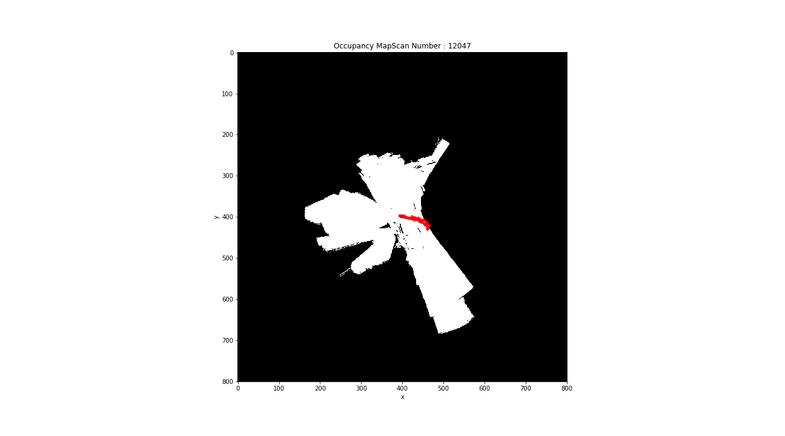

# SLAM
The code to perform SLAM based on particle filter and Occupancy map estimation. 

In the image above red path shows the path taken by the robot and white space is the area sweeped by the robot. All the code is present in the mapping.py file. There are multiple functions inside which perform appropriate actions to over all acheive SLAM. 

1) init_map : This creates a MAP based on settings provided. Here one can choose the resolution, x and y size of the MAP. 
2) slam : This is the heart of the code and acts like an orchestrator in calling other functions and acheiving SLAM. This performs prediction step, update step and resampling, and logging of the important data required. 
3) update_and_map : This function computes the predicted map correlation with actual map. It also does the transformation from LIDAR frame to the world frame along with the corrections like removal of ground detection. This functon also visualizes the MAP and particle location
4) convert2world : Does all the required transformation from LIDAR frame to world frame.
5) mapCorrelation : Is a function that computes correlation between maps in a local region

To run the code on terminal: python mapping.py 
All the hyperparameters required can be set in the mapping.py file. Example of used hyperparameters are shared in the hyper-parameters.

Requirements: Numpy, Matplotlib, sklearn, OpenCV
